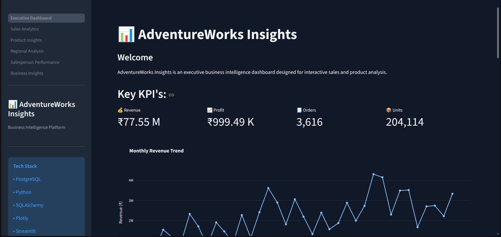
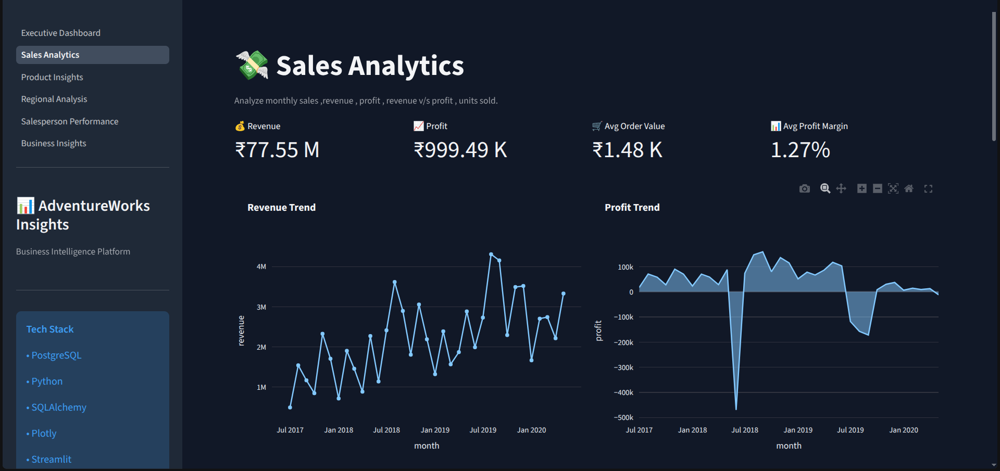
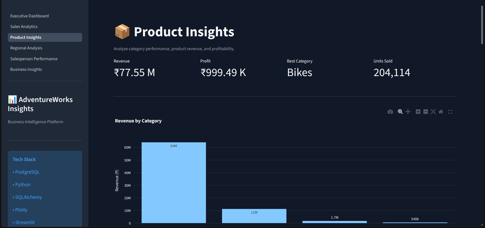
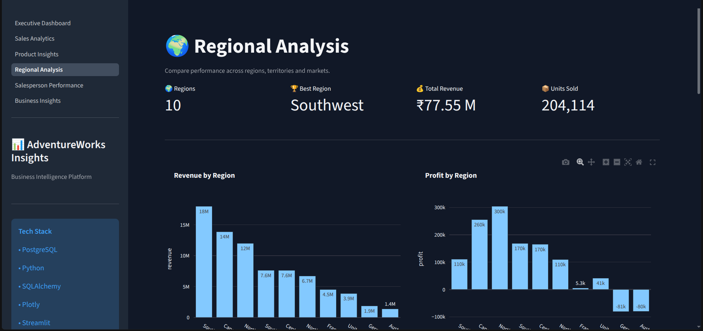
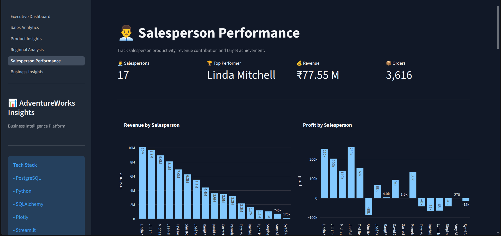
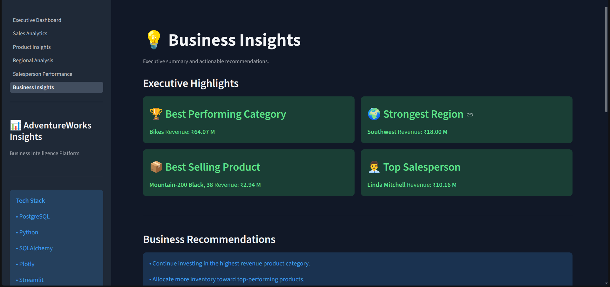

# AdventureWorksInsights

A business intelligence and sales analytics platform built with PostgreSQL, Python, and Streamlit.

## Features
- Executive dashboard
- Sales analytics
- Product insights
- Regional analysis
- Salesperson performance
- Business insights

## Tech Stack

- PostgreSQL
- Python
- SQLAlchemy
- Plotly
- Streamlit
- Pandas

## Project Structure

- app/ - Streamlit application entry point and pages
- app/utils/ - Database and helper utilities
- etl/ - Data cleaning and importing into postgres
- sql/ - Database  views
- data/ - Raw and processed datasets

## Setup
1. Create a PostgreSQL database named `adventureworks`.
2. Create and activate a virtual environment.
3. Install dependencies with `pip install -r requirements.txt`.
4. Run the ETL script:
   python -m etl.import_postgres
5. Load SQL views:
   psql -d adventureworks -f sql/views.sql
6. Run the app with `streamlit run app/Executive_Dashboard.py`.

## Screenshots

### Executive Dashboard

### Sales Analytics

### Product Insights

### Regional Analysis

### Salesperson Performance

### Business Insights

